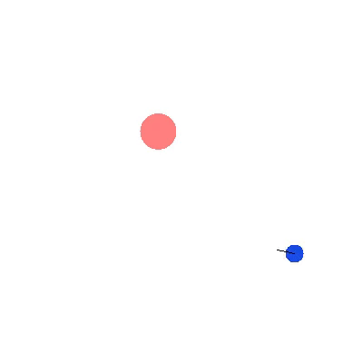

# gym-hybrid

Repository containing a collection of environment for reinforcement learning task possessing discrete-continuous hybrid action space.

## "Moving-v0" 

 

"Moving-v0" is a sandbox environment for parameterized action-space algorithms. The goal of the agent is to stop inside a target area.  
The field is a square with a side length of 2. The target area is a circle with radius 0.1. There is three discrete actions: turn, accelerate, and break. In addition to the action, there is 2 possible complementary parameters: acceleration and rotation. The state is constituted of a list of 10 elements, including: the position of the agent, the direction of the agent, the position of the target, etc.   
The reward is the distance of the agent from the target of the last step minus the current distance. It is possible to add a penalty to the reward to incentivize the learning algorithm to score as quickly as possible. When the Agent is stopped in the target area, it receives a reward of one. If the agent leaves the area or takes too long (maximum step set at 200), the reward is set at minus one and the episode terminates.

### Basics
Make and initialize an environment:
```
import gym
import gym_parametrized
env = gym.make('Moving-v0')
env.reset()
```

Get the action space and the observation space:
```
ACTION_SPACE = env.action_space[0].n
PARAMETERS_SPACE = env.action_space[1].shape[0]
OBSERVATION_SPACE = env.observation_space.shape[0]
```

Run a random agent:
```
done = False
while not done:
    state, reward, done, info = env.step(env.action_space.sample())
    print(f'State: {state} Reward: {reward} Done: {done}')
```


### Actions

**The action ids are:**
1. Accelerate
2. Turn
3. Break

**The parameters are:**
1. Acceleration value
2. Rotation value

**There is two distinct way to format an action:**

Action with all the parameters (convenient if the model output all the parameters): 
```
action = (action_id, [acceleration_value, rotation_value])
```
Example of a valid actions:
```
action = (0, [0.1, 0.4])
action = (1, [0.0, 0.2])
action = (2, [0.1, 0.3])
```
Note: Only the parameter related to the action chosen will be used.

Action with only the parameter related to the action id (convenient for algorithms that output only the parameter
of the chosen action, since it doesn't require to pad the action): 
```
action = (0, [acceleration_value])
action = (1, [rotation_value])
action = (2, [])
```
Example of valid actions:
```
action = (0, [0.1])
action = (1, [0.2])
action = (2, [])
```
### Render & Recording
Two testing files are avalaible to show users how to render and record the environment:
* [Python file example for recording](tests/moving_record.py)
* [Python file example for rendering](tests/moving_render.py)

### Disclaimer 
Even though the mechanics of the environment are done, maybe the hyperparameter will need some further adjustments.

### Reference
This environment is described in several papers such as:  
[Parametrized Deep Q-Networks Learning, Xiong et al., 2018](https://arxiv.org/pdf/1810.06394.pdf)  
[Hybrid Actor-Critic Reinforcement Learning in Parameterized Action Space, Fan et al., 2019](https://arxiv.org/pdf/1903.01344.pdf)  

## Requirements
gym  
numpy

## Installation

Direct Installation from github using pip by running this command:
```
pip install git+https://github.com/thomashirtz/gym-hybrid#egg=gym-hybrid
```  


