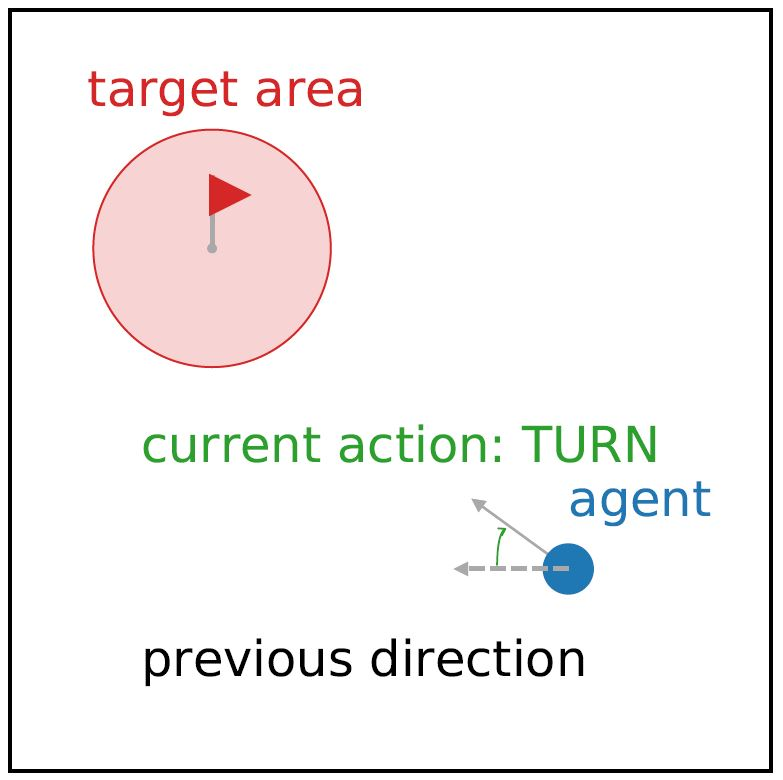

# gym-parameterized

Repository containing a collection of environment for reinforcement learning task possessing parameterized action space.

## "Moving-v0" 

 

"Moving-v0" is a sandbox environment for parameterized action-space algorithms. The goal of the agent is to stop inside a target area.The field is a square
with side length 2 and the target area is a circle with radius 0.1. There is three discrete actions: turn, accelerate, and break; as well as 2 possible parameters: acceleration and rotation. The state is constituted of a list of 10 elements, including the speed, the position, the direction, the position of the target, etc.  
The reward is the distance of the agent from the target of the last step minus the current distance. It is possible to add a penalty to the reward to incentivize the learning algorithm to score as quickly as possible. When the Agent is stopped in the target area, it receives a reward of one. If the agent leaves the area or takes too long (maximum step set at 200), the reward is set at minus one and the episode terminates.

### Utilization

Snippet of code to run the environment:
```
import gym
import gym_parametrized

env = gym.make('Moving-v0')
env.reset()

done = False
while not done:
    state, reward, done, info = env.step(env.action_space.sample())
    print(f'State: {state} Reward: {reward} Done: {done}')
```

### Action

The action is structured as follow: 
```
action = (action_id, [value_rotation, value_acceleration])
```
The action ids are: 
1. Turn
2. Accelerate
3. Break

example of a valid action:
```
action = (1, [0.0, 0.2])
```

### Requirements
gym
numpy

### Disclaimer 
Even though the mechanics of the environment are done, maybe the hyperparameter will need some further adjustments.

### Reference
This environment is described in several papers such as:  
[[Parametrized Deep Q-Networks Learning]](https://arxiv.org/pdf/1810.06394.pdf)  
[[Hybrid Actor-Critic Reinforcement Learning in Parameterized Action Space]](https://arxiv.org/pdf/1903.01344.pdf)  
*The figure comes from the second reference.


